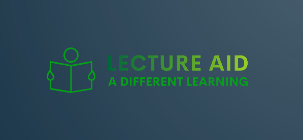
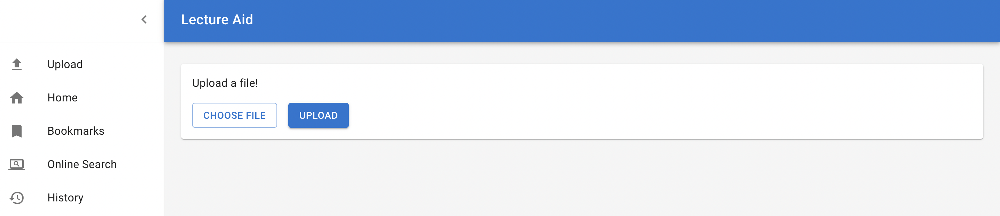
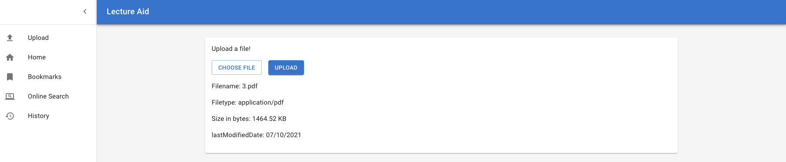
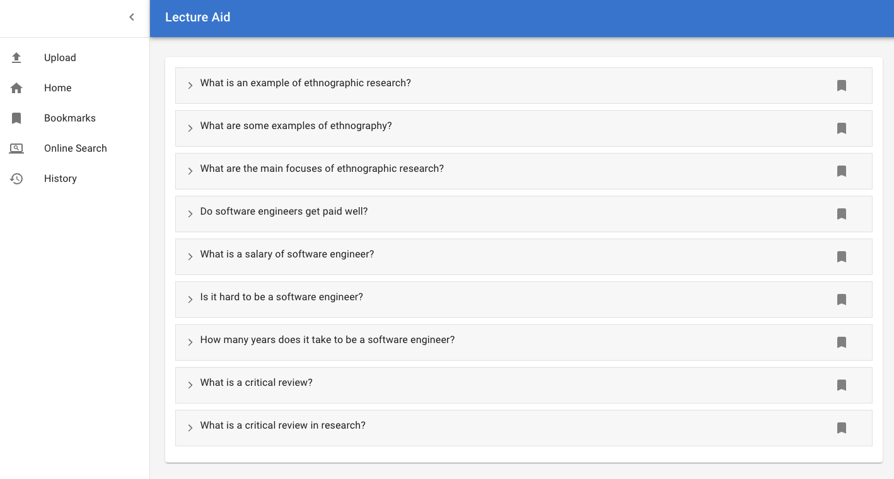
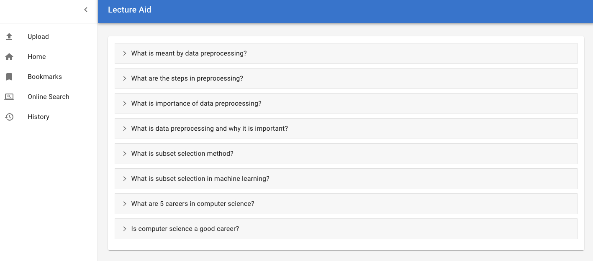
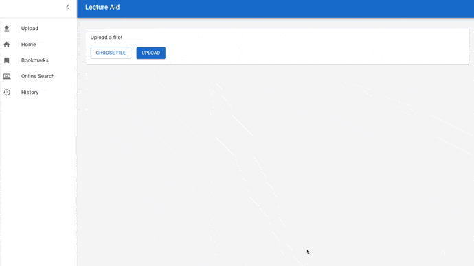

 
# LectureAid

This repo contains the code for LectureAid [v1.0.0](https://github.com/mtkumar123/CSC510_Project_LectureAid/releases/tag/v1.0.0), a project for CSC510 Fall 21. 

The updated version of the project [v2.0.0](https://github.com/NCSU-Group7-SE2021/CSC510_Project_LectureAid/releases/tag/v2.0.0) contains some interesting UI and extended application features that facilitates more seamless learning across platforms.

# What is Project LectureAid?

After a long class, ever had to come back home and google everything you supposedly learnt from the lecture handout for that day's class? Ever spend ~30 - 45 minutes just to search through google and compile a list of websites that explain what you need? And then a month later when midterms are around a corner, ever spend that same 30-45 minutes trying to find those websites again cause you forgot to bookmark them? 

Project LectureAid hopes to solve that hassle for you.

## Phase 1 Features

Upload your lecture pdf, word doc or powerpoint to our user based terminal menu, and LectureAid will extract the text, process it, and search the internet for key topics from that lecture. Once it finds relevant results, LectureAid opens up a browser window with a list of questions relevant to your topic, and website links that should answer said questions, and also a wordcloud that highlights key words in the lecture.

## Phase 2 Feature update

The updated release of this project provides some super cool features to improve the user experience and support multiple file formats.

Here are the list of features we have added:

1. Extended the processing support to different filetypes:
   - Word Document (.doc, .docx)
   - Powerpoint Presentation (.pptx)
   - Text Files (.txt)
   - Markdown Files (.md)

2. Extract answers from the crawled websites and provide a brief overview of the answers. Include the link to read further.

3. An interactive User Interface to help user learn better and in a more appealing way. 

4. Capability to upload file through the UI.

5. Adding a bookmark feature to have important questions handy.

6. Minor improvements in processing data, getting related questions and answers.

# Technologies Used

## The usual backend story
1. Text Extraction from pdfs was done with the help of PyMuPDF. Documentation can be viewed here:
https://pymupdf.readthedocs.io/en/latest/

2. Text Extraction from word documents (docx) was done with the help of python-docx. Documentation can be viewed here:
https://python-docx.readthedocs.io/en/latest/

3. Text Extraction from powerpoint presentation (pptx) was done with the help of python-pptx. Documentation can be viewed here:
https://python-pptx.readthedocs.io/en/latest/

4. Word Processing Logic was done with the help of Spacy. Documentation can be viewed here:
https://spacy.io/api/doc

5. Text extraction for powerpoint files was done with the packaga python-pptx. Documentation can be viewed here: https://python-pptx.readthedocs.io/en/latest/index.html

6. Returning the questions with the relevant links was done with the help of people_also_ask library. Documentation can be seen here:
https://pypi.org/project/people-also-ask/

## The interesting UI part
1. It is a React application. Documentation can be accessible here https://reactjs.org/docs/getting-started.html
2. Material UI is way to go. https://mui.com/getting-started/installation/

# Requirements
## Python powered Backend
- Python (atleast 3.8) and pip
- [Microsoft Visual C++ Build tools](https://visualstudio.microsoft.com/visual-cpp-build-tools/)
- [google-api-python-client](https://github.com/googleapis/google-api-python-client) - Version 2.22.0 or greater
- [people_also_ask](https://pypi.org/project/people-also-ask/) Version 0.0.6 or greater
- [spacy](https://spacy.io/) - Version 3.1.2 or greater
- [spacy-legacy](https://pypi.org/project/spacy-legacy/) - Version 3.0.8
- [spacy models](https://github.com/explosion/spacy-models/releases/download/en_core_web_lg-3.1.0/en_core_web_lg-3.1.0-py3-none-any.whl)
- [pyfiglet](https://pypi.org/project/pyfiglet/0.8.post1/) - Version 0.8.post1
- [PyMuPDF](https://github.com/pymupdf/PyMuPDF) - Version 1.18.19
- [wordcloud](https://pypi.org/project/wordcloud/) - Version 1.8.1
- [matplotlib](https://matplotlib.org/) - Version 3.4.3
- [python-docx](https://pypi.org/project/python-docx/) - Version 0.8.11
- [python-pptx](https://python-pptx.readthedocs.io/en/latest/) - Version 0.6.21
- [flask](https://pypi.org/project/Flask/) - Version 2.0.2

## React-ive Frontend

- [NodeJS](https://nodejs.org/en/download/) 14.x or higher
- React v17.x
- MaterialUI v5.x

# Setup
## Backend
### Setup for MacOS M1 BigSur and higher versions
A few of the libraries are not extensively supported for the latest MacOS M1 arm64 processor as the open source communities are yet to release an automatic installation of build dependencies for these packages. Below are the steps mentioned to setup this project for MacOS.

- Use the below command to cross check the version of the processor. 
  - `uname-m`
- Keep the **python version 3.8** or below for creating the virtual environment.
  - `python3.8 -m venv <environment_name>`
- Activate the environment
  - `source <environment_name>/bin/activate`
- After the virtual environment is setup, install all the dependencies one after another.
  - `pip3 install pyfiglet`
  - `pip3 install pymupdf`
  - `pip3 install spacy`
  - `pip3 install people_also_ask`
  - `pip3 install wordcloud`
  - `python3 -m spacy download en_core_web_lg `
  - `pip3 install python-docx`
  - `pip3 install python-pptx`
  - `pip3 install flask`

### For other OS  
- run `pip install -r requirements.txt`
  - this installs all of the required python libraries
- run `pip install .`
  - this installs the project as a python package

## Frontend 

Assuming the system already has NodeJS and NPM

- Go to `client` using command `cd client`
- Run `npm install`
  - Installs the node modules required to run the web interface
  That's it !!

# How to run

User uploads the lecture pdf, word doc or powerpoint through the GUI, LectureAid process the files and displays relevant results in questions and answers format. The user can bookmark the required questions which will be stored in google chrome cache and the user can view the bookmarked questions in the bookmark tab.

- *Step 1*: Run the server side - flask: (`python app.py`)
- *Step 2*: Run the client side - react : (`npm run start`)
- *Step 3*: Open the browser and go to http://localhost:3000/. You will see a home page like this

- *Step 4*: Choose a file and upload it.

- *Step 5*: Client processes the file and displays the questions and answers. 

- *Step 5*: User can bookmark the required questions by clicking on the bookmark icon.
- *Step 6*: User can view the bookmarked questions on the bookmarks tab. /

### How it works in a nutshell

# Documentation

More documentation can be viewed here:
https://ncsu-group7-se2021.github.io/CSC510_Project_LectureAid/

# Troubleshooting
- When running the code/tests, I'm getting a `no such module named code` error?
  - Try prefixing the command with `python -m`, for example, `python -m pytest`
- When I try to run pip install, I'm getting an error for wordcloud relating to Microsoft C++?
  - Microsoft C++ build tools are needed to generate the wordcloud. See the requirements section for the download link.

# Future work
- #### Host the application on a public server
  Host the application on a public server and provide user account login. Build a database to store the user information and move away from google chrome cache.

- #### Build a browser extension
  Build a browser extension which lets the user to select text from a webpage and send a request to the application and get the links of pdf webpages.

- #### Increase the concurrency efficiency
  Currently, we are using the maximum number of threads (10) for running search queries, but could still be room for improvement using other multithreading/multiprocessing tools.
  
- #### Improve Word Extraction Logic
  Currently Spacy is being used to extract noun phrases from each slide/page of the document. Then the high frequency noun phrases are calculated and used in the final search query. However this causes an issue when every slide has the document’s author name and email address listed. The author name is considered as a noun phrase, and since it appears on every slide has a high frequency, and thus appears on the final search query.

# Contact Us
   E-mail: lectureaidnscu@gmail.com
   
# Team Members

## Phase 2 Team Members
- [Rahul Kalita](https://github.com/rahulkalita8)
- [Vignesh Muthukumar](https://github.com/vickymhs)
- [Eshita Arza](https://github.com/ArzaEshita)
- [Luis](https://github.com/lgdeloss)
- [Isha Gupta](https://github.com/isha-bansal0115)
- [Kiran Teja](https://github.com/kirantejatummuri)

## Phase 1 Team Members
- Ashley King
- Manoj Kumar
- Rakesh Muppala
- Sayali Parab
- Ashwin Das
- Renji Joseph Sabu

## All Contributors to-date

